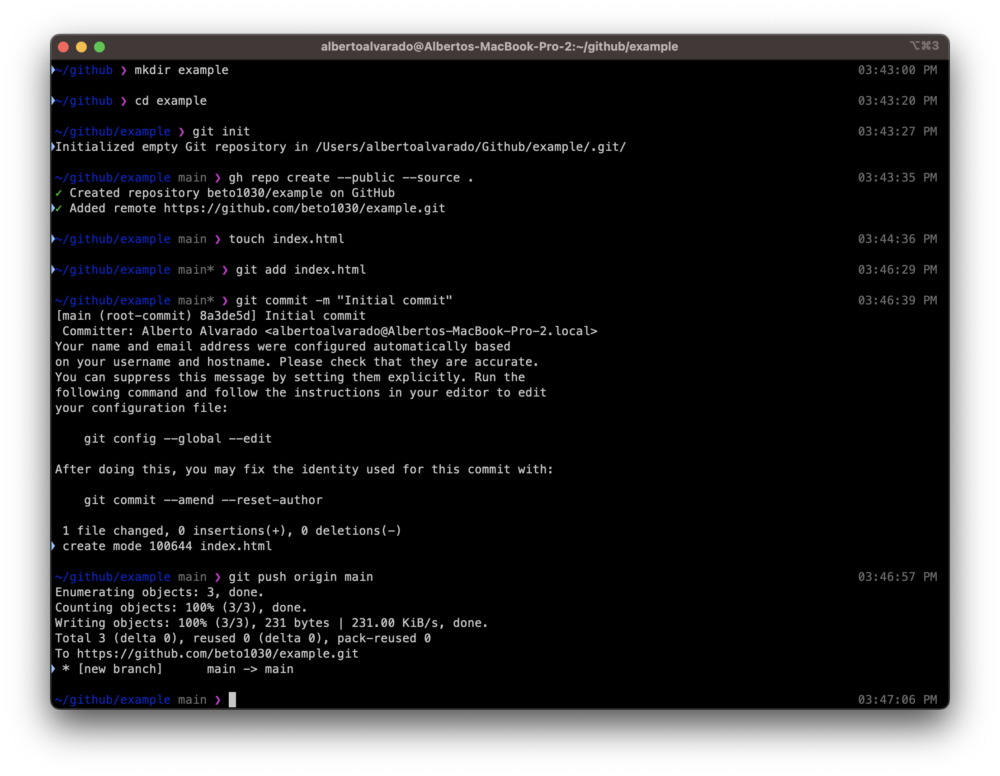

# git

**Description**

Creating a github repo via terminal

### Installation

**git**
```
brew install git
```
**gh-pages**
```
npm install gh-pages
```


### Workflow
**Step 1**
Create a project

**Step 2**
Initialize git

**Step 3**
Create remote repo on github using gh-pages

**Step 4**
Create a file

**Step 5**
Add file just created to git staging area

**Step 6**
Commit changes

**Step 7**
Push changes to github

**Step 8** *(optional)*
If you are creating a website, you can publish it online using this script. Place it inside of package.json under scripts
```
"publish": "gh-pages -d ."

```
Your published project will be **\<github-username\>.github.io/\<project-name\>**

Look at mine for example **https://beto1030.github.io/odin-recipes**


